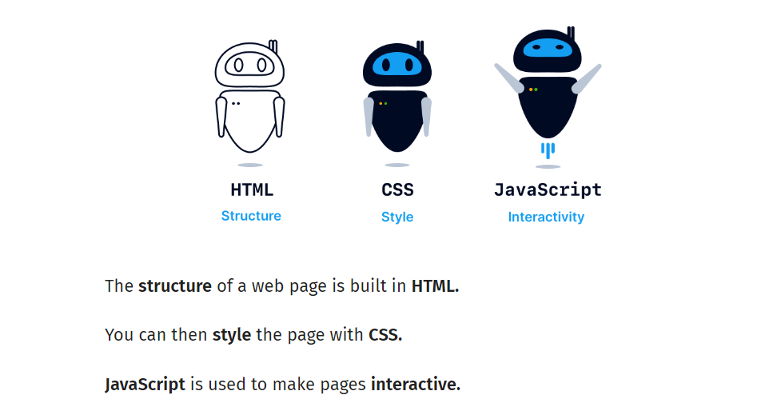

HTML
===========

 —— opening tag and closing tag

  —— self-closing tag

- tag/element: make up the main structure of html files

- attribute: included in the opening tag for additional info, such as ``src|href|class|id``.

- rule: define style of certain elements, a :abbr:`CSS (Cascading Style Sheet)` file may have as many rules as possible.

- class: rules (start with "." in CSS) contained in the ``class`` attribute modify a class of elements.

- id: rule (start with "#" in CSS) contained in the ``id`` attribute modify only one element. ie, one id can only be used to one tag.

- property: defined styles included in a rule. For example, in rule ``p{color: red;}``, ``color`` is a property and its value is ``red``.

.. code-block:: html
   :caption: HTML 模板

   <!doctype html>
   <html>
        <head>
             <link rel="stylesheet" href="style.css">
             <title> </title>
             
        </head>
        <body>
             <h1> </h1> <!-- 标题共 6 级 h1 - h6 -->
             
 

              
             <em> </em>
             <strong> </strong>
             
             
             <button> </button>
        </body>
   </html>

.. code-block:: css
   :caption: CSS 模板

   p{
   color: red;
   background-color: blue;
   font-style: italic;
   font-weight: bold;
   font-family: Helvetica;
   font-size: 10px;
   width: 100px;
   height: 100px;
   border: solix 10px red;
   /* if an image is square (such as 100px x 100px), setting border-radius to half of the width makes the image a round circle. */
   border-radius: 30px 30px 30px 30px; /* in clockwise order: top-left top-right bottom-right bottom-left */
   padding: 50px;  /* generates space between content and border of an element. C-P-B-M */
   padding: 20px 0 20px 0; /* in clockwise order: top-right-bottom-left */
   padding-left: 200px;
   padding-right:
   padding-top:
   padding-bottom:
   text-align: center;
   margin: ;     /* generates space around an element, outside of border */
   margin-top: 20px;
   }

:numref:`html_sample` 的来源网址是 `Codecademy <https://www.codecademy.com/courses/learn-html/lessons/intro-to-html/exercises/review-html-structure>`_

.. code-block:: html
    :caption: html 简短示例
    :name: html_sample

        <body>
          <h1>The Brown Bear</h1>
          

            <h2>About Brown Bears</h2>
            
The brown bear (<em>Ursus arctos</em>) is native to parts of northern Eurasia and North America. Its conservation status is currently <strong>Least Concern</strong>.   There are many subspecies within the brown bear species, including the Atlas bear and the Himalayan brown bear.

            <h3>Species</h3>
            <ul>
              <li>Arctos</li>
              <li>Collarus</li>
              <li>Horribilis</li>
              <li>Nelsoni (extinct)</li>
            </ul>
            <h3>Features</h3>
            
Brown bears are not always completely brown. Some can be reddish or yellowish. They have very large, curved claws and huge paws. Male brown bears are often 30% larger than female brown bears. They can range from 5 feet to 9 feet from head to toe.

          

          

            <h2>Habitat</h2>
            <h3>Countries with Large Brown Bear Populations</h3>
            <ol>
              <li>Russia</li>
              <li>United States</li>
              <li>Canada</li>
            </ol>
            <h3>Countries with Small Brown Bear Populations</h3>
            
Some countries with smaller brown bear populations include Armenia, Belarus, Bulgaria, China, Finland, France, Greece, India, Japan, Nepal, Poland, Romania, Slovenia, Turkmenistan, and Uzbekistan.

          

          

            <h2>Media</h2>
            
            <video src="https://content.codecademy.com/courses/freelance-1/unit-1/lesson-2/htmlcss1-vid_brown-bear.mp4" width="320" height="240" controls>
            Video not supported
            </video>
          

        </body>
    

    HTML+CSS+JavaScript

Text Formatting
-----------------

:raw-html:`<b>粗体</b>`\： ``<b>...</b>`` 或者 ``<strong>...</strong>``

:raw-html:`<i>斜体</i>`\： ``<i>...</i>`` 或者 ``<em>...</em>``

:raw-html:`<u>下划线</u>`\： ``<u>...</u>`` 或者 ``<ins>...</ins>``

:raw-html:`<s>删除线</s>`\： ``<s>...</s>`` 或者 ``<del>...</del>``

.. note::

   The <strong> element is for content that is of greater importance, while the <b> element is used to draw attention to text without indicating that it's more important. They both will look the same but from syntax perspective they are entirely different.

   <strong> should be used preferentially because for users with impaired vision their screen reader will read something in a <strong> tag with different emphasis. Same thing for <em> and <i> tags, both will italicise the text on the screen but <em> will result in screen readers literally putting more emphasis on the text within the tag. So from what I understand, it's all about trying to be inclusive.

   Tags such as <b>, <i>, and <u> do not convey any semantic meaning or importance to the text. They are used solely for visual presentation. Whereas tags like <strong>, <em>, <ins>, <del> indicate semantically changed meaning to the text.

   <strong> and <em> can be called :raw-html:`<strong>Semantic formatting tags</strong>`\.

div
-----------

在 HTML 中，
 标签是一个通用的块级容器元素，用于将内容分组或组织成不同的部分。它本身没有任何特定的视觉效果，但可以通过 CSS 样式进行控制。
 常用于布局、结构化页面和组织内容。

**基本用法**

.. code:: html

        

            <!-- 这里是要分组的内容 -->
            
这是一个段落。

            
这是另一个段落。

        

**配合 CSS 使用**

 通常与 CSS 结合使用，以控制它的外观、布局和行为。

.. code:: html

        

            
带有样式的段落。

        

.. code:: css

            .container {
                background-color: lightblue; /* 设置背景颜色 */
                padding: 20px;               /* 设置内边距 */
                border: 1px solid black;      /* 设置边框 */
            }

**使用场景**

1. 布局设计：`
` 可用于创建页面布局，例如页眉、导航栏、主内容、页脚等。
2. 分组内容：将多个相关的元素放在一个 div 中，便于组织和应用样式。
3. 响应式设计：配合 CSS 的 flexbox 或 grid，使用 
 构建响应式页面。

**与其他元素的区别**

 vs ：

  
 是块级元素，它会独占一整行，而  是行内元素，通常用于内联样式或小范围的文本包装。

Table
-----------

::

        <table>
          <thead>
            <tr>
              <th>...</th>
              <th>...</th>
            </tr>
          </thead>
          <tbody>
            <tr>
              <th>...</th>
              <td>...</td>
            </tr>
          </tbody>
        </table>

table---

  attribute: width='' deprecated.应使用 CSS 设置样式

tr---table row

td---table cell data

  attribute: colspan='' 合并单元格

th---table headding 
 
  attribute: scope='col'/'row' 指定该表头用于行还是列

form
---------

We can think of the internet as a network of computers which send and receive information. Computers need an HTTP request to know how to communicate. The HTTP request instructs the receiving computer how to handle the incoming information. 

The <form> element is a great tool for collecting information, but then we need to send that information somewhere else for processing. We need to supply the <form> element with both the location of where the <form>‘s information goes and what HTTP request to make. Take a look at the sample <form> below:

.. code:: html

        <form action="/example.html" method="POST">
          <h1>...</h1>
          
...

          <label for='login'>登录</label>
           
          <input type='text' name='username' value='张三' id='login'>

          <select id='' name=''>
            <option value=''>xxxx</option>
          </select>

          <textarea id='' name='' rows='' cols='' value=''>...</textarea>
        </form>

form---

  attributes:
  
    action--determines where the information is sent.
    
    method--is assigned a HTTP verb that is included in the HTTP request. It does not need to be capitalized.

label---

  attribute: for--用于匹配 input 元素中的 id。

input--- 是闭合标签！！

  attributes:

    type--determines how it renders on the web page and what kind of data it accepts. Default is 'text'.

      type-text, password, number, range, checkbox, radio, submit

    name--the name of the input information. The user-typed info is paired with 'name' value, and they are sent when the form is submitted.

    value--assign a default value so that users have a pre-filled text field.

    id--for use in label element

    step--用于 number 或 range type，显示数字增减按钮或增减大小。

    min--用于 range type

    max--用于 range type

    list--用于 datalist 元素，其值应为 datalist 元素中 id 参数的值

    required--不需要设置值，表示必填窗口项。

    minlength--输入的最少字数要求

    maxlength--输入的最大字数要求

    pattern--设置正则表达式，规定输入的要求（如需要设置输入14-16位银行卡号，则 pattern='[0-9]{14,16}'）

    在上述代码块示例中，张三为预先填好的信息，提交表格时会将 'username=张三' 提交给服务器。

select--- 用于下拉列表选择

  attributes:

    id-- 用于 label 元素

    name-- 用于表格提交

datalist--- 用于可以输入查找的下拉列表选择

  attribute: id-- 用于匹配 input 元素中的 list

  datalist 元素中的 option 中间不用加文字，因为是需要用户输入并匹配选项。而 select 元素中的 option 子元素中间需要加文字，因为其是需要用户下拉选择选项。 

option---

  attribute: value--用于表格提交

textarea--- 用于长文本框（填写意见/投诉等）

    
Form Validation
-------------------

Validation is the concept of checking user provided date against the required data.

server-side validation：数据传至服务器进行验证（如用户登录）

client-side validation：在浏览器（客户端）检查数据，发生于数据传输至服务器之前。

不同浏览器都共用 HTML5 内置的客户端验证。

.. code:: html
    
     <figure>
       
       <figcaption>xxxx</figcaption>
     </figure>

     <audio controls>
       <source src='' type=''>
     </audio>

     <video src='' controls autoplay loop>Video Not Supported</video>

.. code:: html
   
        <!DOCTYPE html>
        <html>
          <head>
            <link rel="stylesheet" type="text/css" href="style.css">
          </head>
          <body>
            <header>
              <h1>Navigational Links</h1>
              <nav>
                <ul>
                  <li><a href="#home">Home</a></li>
                  <li><a href="#posts">Posts</a></li>
                  <li><a href="#contact">Contact</a></li>
                </ul>
              </nav>
            </header>
            
            <main>
              <section>
                <article>
                  <h2>Facts About Dogs</h2>
                  

                  Dogs have a sense of time. It's been proven that they know the difference between a hour and five. If conditioned to, they can predict future events, such as regular walk times.
                  

                </article>
                <aside>
                  
A study was conducted on dogs being away from their owners for varying hours and the studies show that dogs who were away from their owners the longest showed the greatest amount of affection!
                  
 
                </aside>
              </section> 
              <figure>
                
                <figcaption>A cute dog.</figcaption>
              </figure>  
              <audio controls>
                <source src="https://content.codecademy.com/courses/SemanticHTML/dogBarking.mp3" type="audio/mp3">
              </audio> 
              <video src="https://content.codecademy.com/courses/SemanticHTML/dog-video.mp4" controls>
              </video>
              <embed src="https://content.codecademy.com/courses/SemanticHTML/dog-on-beach.gif"/>
                 
            </main>
            
            <footer>
              
Contact me at +1 234 567 8910 

            </footer>
                      
          </body>
        </html>
    

- Semantic HTML introduces meaning to a page through specific elements that provide context as to what is in between the tags.

- Semantic HTML is a modern standard and makes a website accessible for people who use screen readers to translate the webpage and improves your website’s SEO.

- <header>, <nav> , <main> and <footer> create the basic structure of the webpage.
  
- <section> defines elements in a document, such as chapters, headings, or any other area of the document with the same theme.

- <article> holds content that makes sense on its own such as articles, blogs, comments, etc.
  
- <aside> contains information that is related to the main content, but not required in order to understand the dominant information.

- <figure> encapsulates all types of media.

- <figcaption> is used to describe the media in <figure>.

- <video>, <embed>, and <audio> elements are used for media files.

